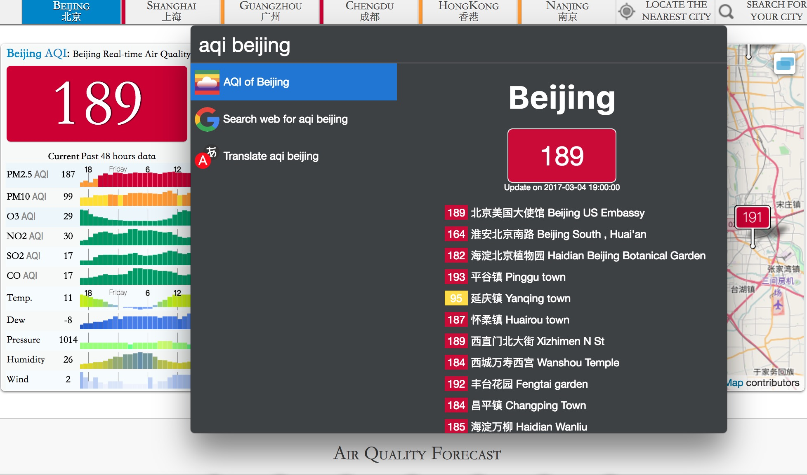

# cerebro-AQI

> [Cerebro](http://www.cerebroapp.com) plugin to search air quality information

## Usage

In Cerebro, type `aqi` and a city name, to search the Air Quality Index information.

## Related

- [Cerebro](http://github.com/KELiON/cerebro) – main repo for Cerebro app;
- [aqicn.org](http://aqicn.org/) - provide the AQI data

## License

MIT
